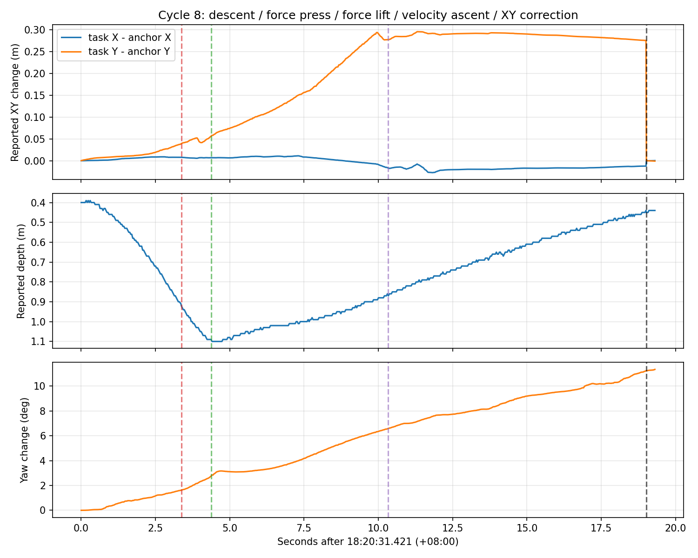

# Sessions 检查：抓海参实际运行记录

检查日期：2026-10-11。时间均为UTC+8。检查包括ROS日志、轨迹、事件、录像进程日志，
并用ROS反序列化读取SQLite rosbag中的PoseInfo、原始pos和status；没有回放发送控制消息。

## 记录范围

| Session | 内容 | 记录结论 |
|---|---|---|
| `20260519_001406` | 建图；3105条有效ROS日志，另1行不完整 | 有3次任务链完成；没有抓海参记录，没有视频文件 |
| `20261010_180812` | 抓海参；4460条ROS日志，原始pos/status延续到约18:30:47 | 14次下压锚点记录，13次进入近底开环，11次完整XY锚点校正；记录中没有整项海参任务完成 |

两个manifest都仍标记RUNNING，未记录正常结束事件。该状态不能证明任务目前仍在运行。
最新会话最后一条任务日志为18:30:09.659的下压锚点记录，后续没有该轮结果；
即使bag仍有底层位置，也不能补出缺失的任务结论。

## 1. 这批记录运行的是修正前逻辑

首轮参数启用近底开环、下压前XY恢复、收集框视觉及框心地标校正，舵机1水平补偿为
`(+0.30,+0.10)m`。日志仍是“收集框居中容差=0.08”和“记录下压前XY”，
没有本次新增的`contact_body_xyz`、实际爪子落点或可见内部区域伺服。
因此不能据这批session验证本次修改是否有效。

18:12:56、18:14:25、18:16:17的参数日志均关闭了
`collection_visual_align`和`collection_correct_odom_xy`。
爪子y补偿分别改为0、0、0.04m，下压速度/时长由0.5m/s、5.3s改成0.4m/s、7s。
后续记录没有再次出现收集框视觉对准，不能把后续释放当作视觉投放成功。
证据：ROS日志L41、L418、L929、L1214、L1615。

## 2. XY校正实际执行了，但不能证明修正量全部来自DVL误差

11次完整离底后校正的模长为约0.051～0.276m，每次都记录了BasicMotion服务成功的
“任务odom平移修正”；原始MCU位置未改写。各次dy均为正，不是随机正负跳动。

以18:20:31开始的一轮为例：

| 阶段 | 时间 | 任务y / m |
|---|---|---:|
| 爪子补偿后的下压锚点 | 18:20:31.421 | −2.583 |
| 切入纯推力下压 | 18:20:34.798 | −2.544 |
| 开始纯推力离底 | 18:20:35.800 | −2.527 |
| 恢复速度上浮 | 18:20:41.754 | −2.305 |
| 上浮到观察深度、即将校正 | 18:20:50.436 | −2.307 |

这一轮总dy≈+0.276m，其中约+0.222m发生在纯推力离底段。
该时段原始pos的变化也以连续累积为主，未出现单帧28cm跳变。
这可能包含真实横移、持续导航误差或两者叠加，不能凭这一记录区分。
目前把全部变化恢复到旧XY的假设没有获得独立视觉/外部定位证据。
证据：ROS日志L2658、L2664、L2708～L2710及bag PoseInfo/pos。

图中虚线依次为纯推力下压、纯推力离底、速度上浮、XY校正；XY曲线显示的是
导航反馈，校正位置处的突变是坐标平移，不应解释为机器人瞬间移动。
所有14轮的统计见[CSV](20261010_180812_cycles.csv)，空白表示对应阶段记录缺失。

## 3. 近底高度和姿态影响确实存在

13次开环切入深度都在z≈0.90～0.92m，符合旧公式
`1.20−z−0.10≤0.20`，说明原任务没有以0.29m圆盘爪位置判断20cm门限。
这些时刻pitch通常约−7°～−9°。按圆盘爪名义`[-0.43,0,0.29]m`和同一深度基准
推算，切入时爪子剩余高度常只有约5～8cm；这仍是依据名义几何的推算，不是实测离地距离。
本次代码新增三维接触点及roll/pitch投影，正是针对这部分遗漏。

多轮下压/上浮期间航向改变约14°～23°，例如18:27:19一轮从−82.49°变到−59.56°。
对距机体原点水平约0.43m的圆盘爪，23°旋转本身就可使接触参考点相对世界方向
改变约17cm，即使艇体原点XY没有变化。恢复艇体XY不能自动消除这段抓取点运动。
纯推力零姿态轴允许这种变化；实际抓取点是否移动/海参是否滑落，录像缺失无法验证。

首轮开环下压实际只持续约0.666s：先用约4.635s接近池底，剩余总下压预算不足配置的1s。
其他已记录开始上浮的轮次约为1s。因此首轮下压强度也受到总时长截断影响。

## 4. 连续失败重抓时，观察深度逐轮变深

同一轮任务中，下压前观察深度从约0.21、0.28、0.34、0.40变到0.48m；
对应返回深度约0.26、0.29、0.36、0.44、0.52m。
后一次任务也有0.21→0.26→0.33→0.43m的趋势。

代码按本轮实测观察深度上浮，容许5cm提前结束；下一轮伺服再次保持当时实测深度，
连续失败重抓路径不会回到固定`search.pose.z=0.20m`。
这一行为会累积观察高度变化，破坏抓前/抓后视野的一致性。
计数有6→7、3→5、2→4，已说明当前数量观测不足以稳定证明抓取结果。
是否因为掩膜碎片、误识别或目标进出视野，没有检测帧/录像无法进一步判定。
证据：CSV第5～9、10～13轮；ROS日志L1506、L2524、L2890。

## 5. 首轮收集框失败发生在地标阶段，随后一次停止发生在PoseInfo链路

18:09:51.004收集框视觉居中明确通过；18:09:51.418日志报告“视觉已通过，但地标采样
或odom校正失败”，随后回到配置点兜底，18:09:58.909发出释放指令。
不能把这次失败等同于视觉居中超时。此处没有服务成功日志或更具体拒绝原因，
且bag没有保存检测消息，无法确认是哪一张地标采样触发失败。
证据：ROS日志L477～L480、L533。

18:11:04.176任务停止的直接原因是“速度上浮期间丢失实测位姿”。
bag中最近PoseInfo位于18:11:03.162，年龄约1.014s，吻合任务1s新鲜度判定；
当时原始pos年龄约0.023s、status约0.002s，仍报告armed/ready为true。
此前18:11:00.062～18:11:02.456还存在约2.395s的PoseInfo接收空档。
因此不能认定底层位置和状态全部断流；需定位BasicMotion发布、DDS传输、节点生命周期
或回调调度。记录未给出具体中断原因。该轮近底离底深度还曾长时间停在约1.10m。
证据：ROS日志L756～L787及bag三类消息。

## 6. 录像没有成功保存

两个session的front/down均没有.ts或.m3u8文件。最新session两路录像进程各重启751次，
进程日志反复报告`HTTP TS recorder produced no complete HLS segment`并以1退出。
帧索引中的decoder_frame_index重复为0，不能作为可回看图像文件；status里“recording”
和frames=1也不代表成功保存。具体编码/封装错误没有详细FFmpeg输出可供确认。

两份录制配置均未保存图像或感知检测、控制指令话题；最新bag也未保存`/zit6/state/odom`。
因此本次只能确认任务日志、坐标反馈和部分状态，不能验证框裁切形状、真实落点、
实际收到的推力指令或DVL逐帧底跟踪状态。

## 后续修正优先级

1. 部署并验证本次新增的爪子离底参考点和可见区域投放，核对实际接触点及投影距离。
2. 修正失败重抓路径的观察深度累积，恢复固定扫描高度后再比较抓前/抓后数量。
3. 用固定视觉地标或其他独立观测区分真实横移与导航误差；XY差不能直接全量算作DVL偏移。
4. 定位PoseInfo停更和录像退出，增加原始odom、检测和指令记录，才能闭合后续实机验证。

本次仅检查记录并生成报告/统计图，没有继续修改任务执行代码。
